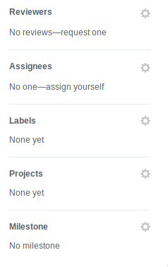
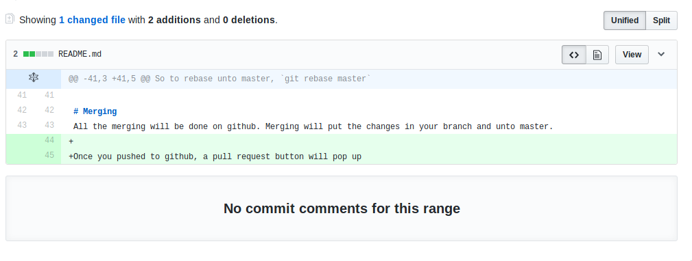
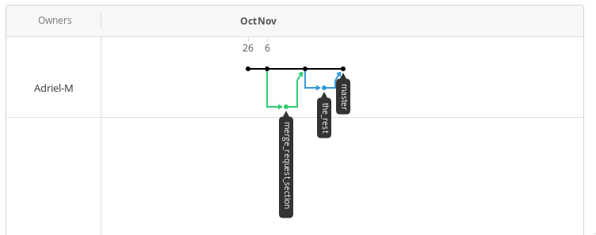
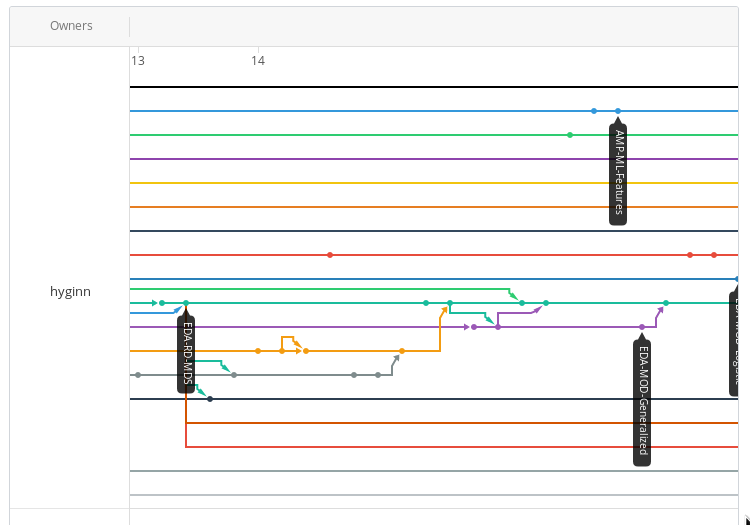

# BCB430-Git-Usage
How to use git (on linux and macs)

To work successfully with git on software projects, there are only three concepts required:
* Branching
* Rebasing
* Merging
    * Handling merge conflicts

# Branching
Branching is a way to work with your own copy of the code base without messing up other people's code base.
A branch can be used to introduce a new feature, fix a bug, and so on. If The code on your branch is incomplete
or breaks some sort of functionality, the main (master) branch and every other branch is not affected at all
until the changes on your branch is merged.

To create a new branch.
_note: this will create a new branch that is based on the current branch you're on_

cli:
`git checkout -b my_new_branch`

rstudio:
Click on 

To switch branches

cli:
`git checkout the_other_branch`

rstudio:
Click on the branch dropdown beside the New Branch Button

# Rebasing
Rebasing is a way to play your commits on your branch unto another branch. Rebasing is usually to keep your branch
up to date with master.

cli:
`git rebase <the_branch_to_rebase_on>`

So to rebase unto master, `git rebase master`

# Merging
All the merging will be done on github. Merging will put the changes in your branch and unto master.

Once you pushed to github, a pull request button will pop up on github.

Once that button has been pressed, the pull request page will be opened.

## Title and description
Here you can give an overview on what was done with the branch.

## Reviewers and Assignee
For the purpose of the project, we will just use Assignee. Just select the person you want to review your pull request.
The person assign will be notified an can comment to give improvements. If it is good, they can accept the pull request
and merge the code unto master.

## Diff
This section will show what was different with your branch and the branch you want to merge unto (usually master)

# Handling Merge Conflicts
Well this will be during the meeting.

# Updating
Now that new code has been pushed to master, to keep up to date, checkout master, pull. To have the changes appear unto your branch,
rebase on the updated master branch.

checkout master
`git checkout master`

pull
`git pull`

updating own branch
`git checkout my_branch`
`git rebase master`

# Other resource
[explain git with d3](https://onlywei.github.io/explain-git-with-d3/)

_on a side note_

If everything is done correctly, the git graph should look something like

Not

